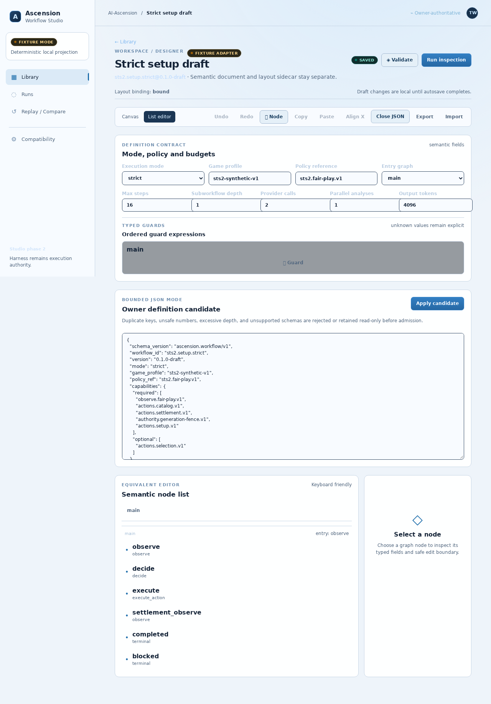

<picture>
  <source media="(prefers-color-scheme: dark)" srcset="https://raw.githubusercontent.com/AI-Ascension/.github/main/profile/assets/banner-dark.svg">
  
</picture>

# Ascension Workflow Studio

Local-first browser application for authoring and inspecting admitted Ascension
workflows. The Studio is a client and presentation layer: canonical workflow
validation, persistence, scheduling, command processing, and gameplay authority
remain in [`AI-Ascension/sts2-harness`](https://github.com/AI-Ascension/sts2-harness).

**Status:** Phase 2 is merged. The checked-in fixture adapter runs without a harness;
the live adapter targets a harness owner API. Evidence is scoped in
[`docs/evidence/PHASE2_EVIDENCE.md`](docs/evidence/PHASE2_EVIDENCE.md), and nothing here
is live or deployed. The compatibility lock against the Phase 1 owner heads is in
[`docs/architecture/phase1-integration.md`](docs/architecture/phase1-integration.md).

To try it, run `npm ci` and `npm run dev` (Vite serves the app locally). Local
commands are listed in [`docs/operations/DEVELOPMENT.md`](docs/operations/DEVELOPMENT.md).

Recorded-run candidate inspection is available through **Recorded runs** and its
ZIP file picker. See [recorded-run import](docs/architecture/recorded-run-import.md)
for the exact protocol pin, local validation CLI, limits and browser verification.

The current product includes a checked-in catalog library, React Flow designer,
keyboard list editor, semantic/layout separation, fixture and relative live
adapters, owner validation, owner-backed draft and publication adapters,
run inspection, revision-safe controls, event projection recovery, replay, and
redacted export. The draft adapter targets the merged additive owner contract
recorded in `docs/architecture/phase1-integration.md`; a Phase 1-only owner
still reports those routes as unavailable.
The exact evidence boundary is recorded in `docs/evidence/PHASE2_EVIDENCE.md`;
fixture behavior does not stand in for a live harness process.

To reproduce the local checks, run `npm ci`, `npm run typecheck`, `npm run lint`,
`npm test`, and `npm run build`. This repository does not deploy or auto-merge
future changes.

CI verifies the accepted Phase 1 artifact digests and every recorded-run Studio
pin before the normal tests. Run `node tools/verify-contract-pins.mjs` and
`node --test tools/verify-contract-pins.test.mjs` locally; the copied protocol
inventory is also checked with `sha256sum --check --strict SHA256SUMS` from
`contracts/recorded-run-candidate`. Update producer pins only alongside reviewed
contract changes and consumer regression results. Historical owner source digests
in the Phase 1 lock remain evidence for those recorded commits, not requirements
that every later owner commit have identical source.

The live-owner browser job builds its immutable harness revision from the harness
directory so Rust honors that revision's `rust-toolchain.toml`. This synthetic,
authenticated loopback check does not establish game or provider compatibility.

AI-Ascension is an independent project. It is not affiliated with or endorsed by Mega Crit or Valve and grants no rights to game files, assets, or marks.
